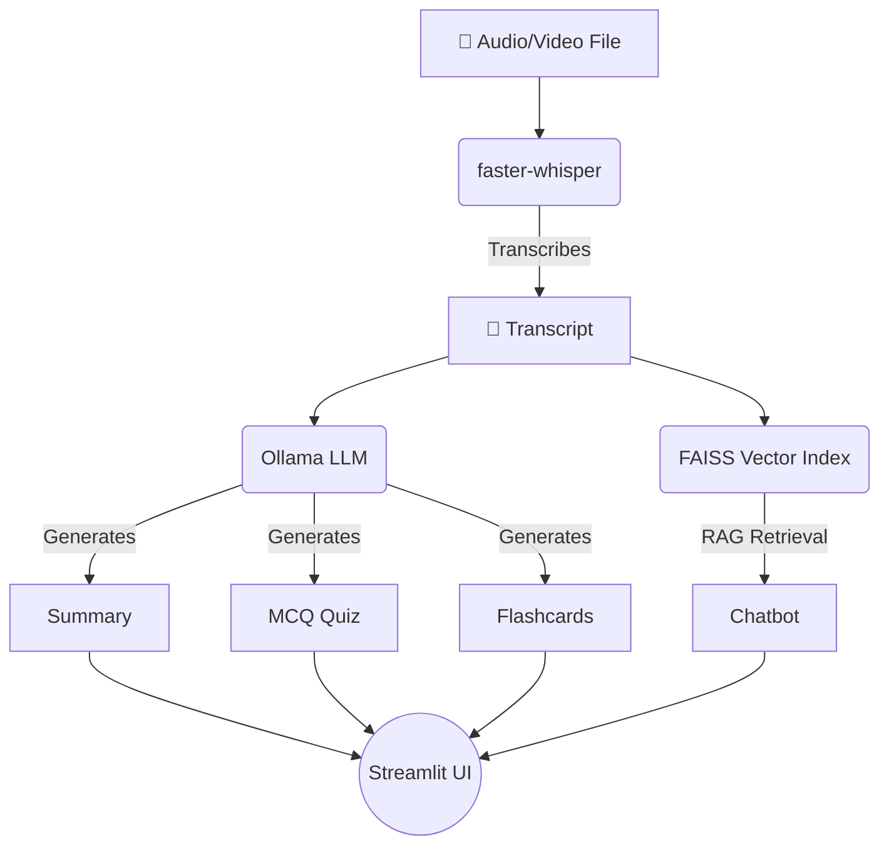

<div align="center">
  
  
  
  
</div>

<div align="center">
  <h1>🎓 Smart Lecture Companion</h1>
  <p><em>Your fully local, open-source AI study companion modeled after NotebookLM.</em></p>
  <p>Created with ❤️ by <strong><a href="https://github.com/adityasri04">adityasri04</a></strong></p>
</div>

---

## 🌟 Overview

**Smart Lecture Companion** is a powerful, privacy-first desktop application that transforms your lecture audio or video files into comprehensive, interactive study packages. Everything runs 100% locally on your machine—no API keys, no internet dependency, and complete data privacy.

Simply upload a lecture, and the AI pipeline will automatically generate:
- 📝 **Structured Markdown Summaries**
- 🧠 **Multiple-Choice Quizzes** (with realistic distractors)
- 📇 **Interactive Flashcards** (for spaced repetition)
- 🤖 **A Dedicated RAG Chatbot** (ask any question, grounded strictly in the transcript)

---

## 🏗️ Architecture

Under the hood, the application stitches together cutting-edge open-source models:



- **Audio Processing**: `faster-whisper` (CTranslate2) for lightning-fast, highly accurate transcriptions.
- **Language Models**: `Ollama` for local LLM inference (defaulting to Llama 3.1).
- **Embeddings & Vector Search**: `SentenceTransformers` (`all-MiniLM-L6-v2`) and `FAISS` for Retrieval-Augmented Generation (RAG).
- **User Interface**: A highly customized, seamlessly transitioning Dark/Light mode `Streamlit` interface.

---

## 🚀 Getting Started

### Prerequisites
- Python 3.10+
- `ffmpeg` (Required by Whisper for audio processing)
- [Ollama](https://ollama.com/) (Required for local LLM inference)

#### Step 1: Install `ffmpeg`
- **macOS**: `brew install ffmpeg`
- **Ubuntu**: `sudo apt install ffmpeg`
- **Windows**: Download from [ffmpeg.org](https://ffmpeg.org/download.html)

#### Step 2: Install and Setup Ollama
```bash
curl -fsSL https://ollama.com/install.sh | sh
ollama pull llama3.1:8b
ollama serve
```

### Installation

1. Clone the repository:
```bash
git clone https://github.com/adityasri04/Smart-Lecture-Companion.git
cd Smart-Lecture-Companion
```

2. Create a virtual environment and install dependencies:
```bash
python3 -m venv venv
source venv/bin/activate
pip install -r requirements.txt
```

3. Setup environment variables:
```bash
cp .env.example .env
```

---

## 💻 Usage

To run the application, you need two terminal windows:

**Terminal 1:** (Keep the LLM server running)
```bash
ollama serve
```

**Terminal 2:** (Run the UI)
```bash
source venv/bin/activate
streamlit run app.py
```
> The application will open automatically in your browser at `http://localhost:8501`.

---

## ⚙️ Customization

### Whisper Model Options
You can change the transcription model in the sidebar. Faster speeds use less memory but trade off accuracy.

| Model | Size | CPU speed | Best for |
|---|---|---|---|
| **tiny** | 75 MB | Fastest | Quick tests / Old machines |
| **base** | 145 MB | Fast | Default — great balance for CPU |
| **small** | 480 MB | Medium | High accuracy |
| **medium** | 1.5 GB | Slow | Premium quality on CPU |
| **large-v3** | 3 GB | Slowest | Absolute best quality, prefer GPU |

### Alternative Ollama Models
Update `OLLAMA_MODEL` in your `.env` file to experiment with different LLMs:
- `llama3.1:8b` — (Default) Exceptional reasoning.
- `phi4` — Microsoft Phi-4, strong quality, smaller (~9 GB).
- `qwen2.5:7b` — Fast, incredible multilingual support.
- `mistral:7b` — Fast and concise summarization.

---

## 🛠️ Troubleshooting

- **`Connection refused`**: Ollama is not running. Run `ollama serve` in a separate terminal.
- **`model not found`**: You haven't downloaded the model yet. Run `ollama pull llama3.1:8b`.
- **`ffmpeg not found`**: You must install the system binary for your OS, not just the python package.
- **Out of memory on Whisper**: Switch the dropdown to `tiny` or `base`.
- **RAG answers seem wrong**: The chatbot is specifically instructed *not* to hallucinate. If the answer isn't in the lecture, it will refuse to answer.

---

<div align="center">
  <p>Built with passion for accessible education by <strong>adityasri04</strong>.</p>
</div>
